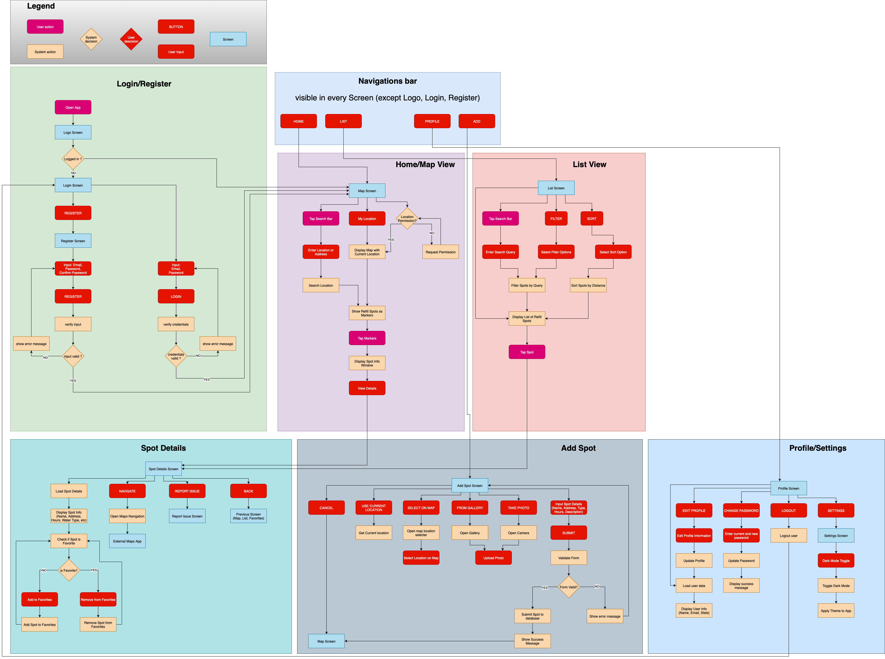

# RefillBuddy - Wasserstellen-Finder App von Arblir Meta

## Was ist das?
Das ist meine Android App für App Entwicklung mit Android SoSe-2025. Die App soll helfen Wasserstellen zu finden wo man seine Flasche auffüllen kann.

- Gemacht von Arblir Meta, Matrikelnummer: 77212022714

## Ablaufdiagramm

## Download APK

[📥 RefillBuddy APK herunterladen](https://github.com/arblirmeta/RefillBuddy/raw/main/app/release/refillbuddy.apk)
